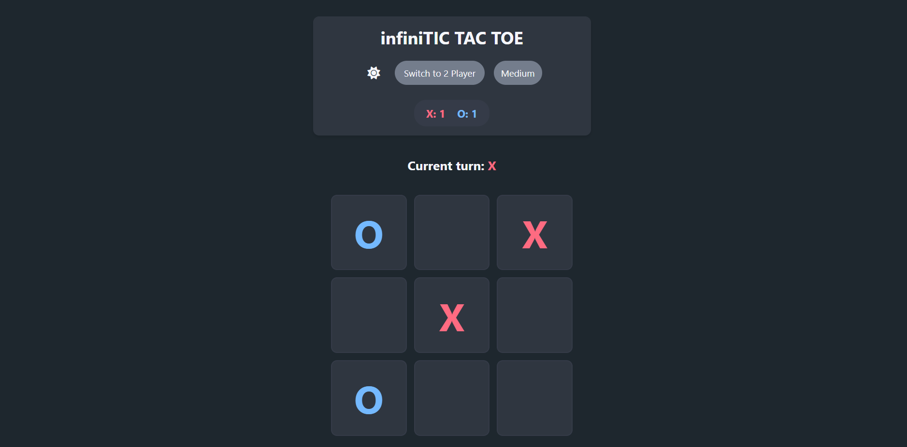

# InfiniTic Tac Toe
    
  [](<https://github.com/Preethikasiva/infinitic-tac-toe/blob/main/LICENSE>)
    
   A modern twist on classic Tic Tac Toe with infinite gameplay mechanics. Players maintain only 3 pieces at a time - the oldest disappears when placing a new one, ensuring no stalemates!
    
  
    
  ## Features
  
  ✨ **Infinite Gameplay** - No more draws! Pieces disappear after 3 moves
  
  🎮 **Two Game Modes** - Play against AI or a friend
  
  🌓 **Dark/Light Mode** - Toggle between whichever mode is preffered 
  
  🎨 **Visual Feedback** - Winning moves highlight with confetti celebration
  
  📊 **Score Tracking** - Keep track of wins for both players
  
  🔧 **Difficulty Settings** - Adjust AI strength (Easy, Medium, & Hard)
  
  
  ## How to Play
  
  1. **Basic Rules**:
     - Place X or O on a 3×3 grid
     - After placing your 3rd piece, your oldest piece disappears when you place a new one
     - First to get 3 in a row wins!
  
  2. **Controls**:
     - Click any empty cell to place your mark
     - Use the "Switch Mode" button to toggle between PvP and AI modes
     - Adjust AI difficulty when in AI mode
     - Toggle dark/light mode with the moon/sun icon
  
  ## Installation
  
  No installation needed! Play directly in your browser:
  
  1. Clone the repository:
     ```bash
     git clone <https://github.com/Preethikasiva/infinitic-tac-toe.git>
     
     ```
  
  1. Open `index.html` in your browser
  
  Or play online at: [Demo Link](http://infinitictactoe.com/)
  
  ## Technologies Used
  
  - HTML5, CSS3, JavaScript
  - Canvas Confetti for win celebrations
  - Font Awesome for icons
  - localStorage for theme persistence
  
  ## AI Implementation
  
  The AI uses three difficulty levels:
  
  - **Easy**: Random moves
  - **Medium**: 50% chance of smart moves
  - **Hard**: Strategic moves (prioritizes wins, blocks opponents, takes center)
  
  ## Customization
  
  You can easily customize:
  
  - Colors in `styles.css` (CSS variables)
  - Sounds by replacing `place-sound.mp3`
  - Animations in the CSS `@keyframes`
  
  ## Known Issues
  
  - [ ]  Mobile view could be improved
  - [ ]  Sound effects could be more varied
  
  ## Future Improvements
  
  - [ ]  Add player name customization
  - [ ]  Implement game history/replays
  - [ ]  Add more sound effects
  
  ## Contributing
  
  Contributions are welcome! Please fork the repository and create a pull request with your changes.
  
  ## License
  
  This project is licensed under the MIT License - see the [LICENSE](https://www.notion.so/LICENSE) file for details.
  
  ---
  
  Enjoy the game! 🎉
  
  Developed with ❤️ by Preethika
